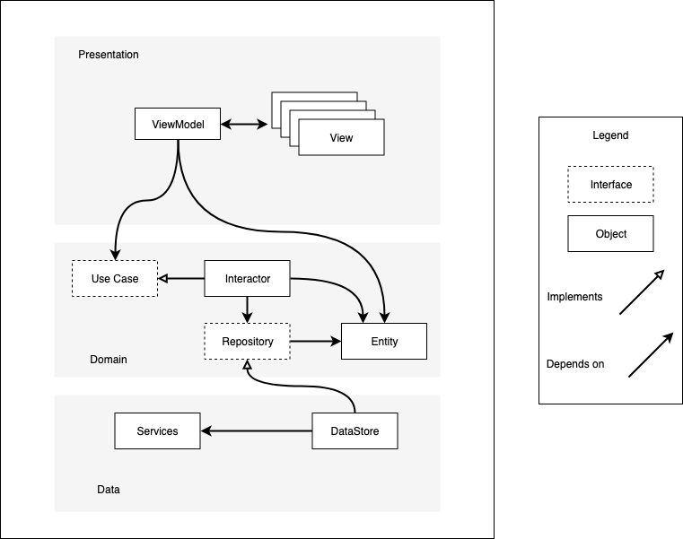

# iOS MVVM Architecture with Example

This is a small example project to demonstrate SwiftUI/Combine in an archetecture inspired by [Clean Architecture](https://blog.cleancoder.com/uncle-bob/2012/08/13/the-clean-architecture.html) by Robert Martin.

## Mobile Component Architecture

### Presentation

The Presentation layer consists of Views and ViewModels.  

The Views are concerned with displaying information on screen and the immediate handling of user input.
The ViewModels are concerned with making simple presentation decisions and interacting with Domain objects
such as Usecases and Entities.

### Domain

This is the core of your Application.  The Presentation and Data layers of dependencies on your Domain,
but *not* the other way around.  The domain is independent of the Presentation and Data layers, meaning
it could be compiled and tested without them.

This layer consists of Usecases, Entities, and Interactors.

Usescases are protocols (in non-swift land: interfaces) which the DataModels depend on.  They should be very
simple and [should not be defined together](https://en.wikipedia.org/wiki/Interface_segregation_principle).
The are implemented by other objects (Interactors, Repositories, or DataStores, depending on complexity.)

Entities are simple data objects that your application needs to function.  Functionality should be placed in
entities sparingly, and should be instead placed in Usecases.

Interactors are one of the objects that can implement Usecases.  Interactors are used in more complicated
cases where a Repository or Datastore alone won't satisfy the requirements of a Usecase.

Repositories are protocols, much like Usecases, that define what interactors depend on.  It is the data
layer's responsibility to fulfil these requirements by providing objects that implement these protocols.

### Data

The data layer is concerned with retrieving and saving of data.

Datastores are simple objects that can retrieve/load/save Entities.  They implement repository protocols for
interactors to use.

### Considerations

Less is more.  Depending on the functionality one is trying to provide, one or more of these layers may be unnecessary.
For example, if the functionality is purely presentation, then the domain and data layers shouldn't be engaged.
However, care must also be taken not to make domain or data decisions in the presentation layer.

There are also platform specific constructs which don't fit neatly into these layers.  Such as the AppDelegate.
Limiting use of these constructs to what is absolutely necessary is recommended.

## Example

The app has a small number of features:

- A list of Things
- Create a Thing
- A thing can be "visible" or "invisible" which is indicated in the list.
- We can fail at creating a Thing
- There is a detail view in which a Thing's visibility can be changed

The View is accomplished in SwiftUI.  There is a ListView, a ListItem, and a DetailView for Thing.  Functionality
has been abstracted out from the view code into the ViewModel, which is defined as an extention to the ListView
in order to scope it (so the type is `ThingListView.ViewModel`).

The ViewModel is an `ObservableObject`, which means it has `@Published` properties to which SwiftUI
can directly bind.  It also has functionality which can easily be called from SwiftUI actions.  This ViewModel
is a little overloaded, so it can not only list Things, but update them.  This functionality is implemented
in the DetailView, so it will need to know about the ViewModel.  This is done by the `@EnvironmentObject` in
the ThingListView.  It is created and passed in by the owner of the ListView, and is then available as an
`@EnvironmentObject` to any decendent.  Note how it's used in the ListView and the DetailView, but not in
the intermediate ListItem.

The ViewModel accomplishes its goals by using UseCases and Entities.  There is one simple Entity for this
app called Things, and there are several use cases for listing, creating, modifying the Things, and also
one to simulate an error.

This app contains a single data store to manage the Things.  This is obviously a trivially simple implementation,
but normally this is where service code or disk storage code would go.  In more complex situations, it may
be advantageous to use a Repository to manage multiple data stores. 

## Unit Tests

The ViewModel and the Datastore are both fully unit tested, but the SwiftUI views are not unit tested.  Unit
tests on view code are of lower value and more difficult, even with the view being written in SwiftUI than
other code.  Unfortunately, Views that are not unit tests still show up in the coverage report as uncovered.
SwiftUI code could be unit tested using [this library](https://github.com/nalexn/ViewInspector), if desired.

## SwiftUI Links
### WWDC Videos
- [Introducting SwiftUI](https://developer.apple.com/videos/play/wwdc2020/10119)
- [Data Essentials in SwiftUI](https://developer.apple.com/videos/play/wwdc2020/10040/)
### Other Articles
- [SwiftUI Archtecture](https://nalexn.github.io/clean-architecture-swiftui/)
